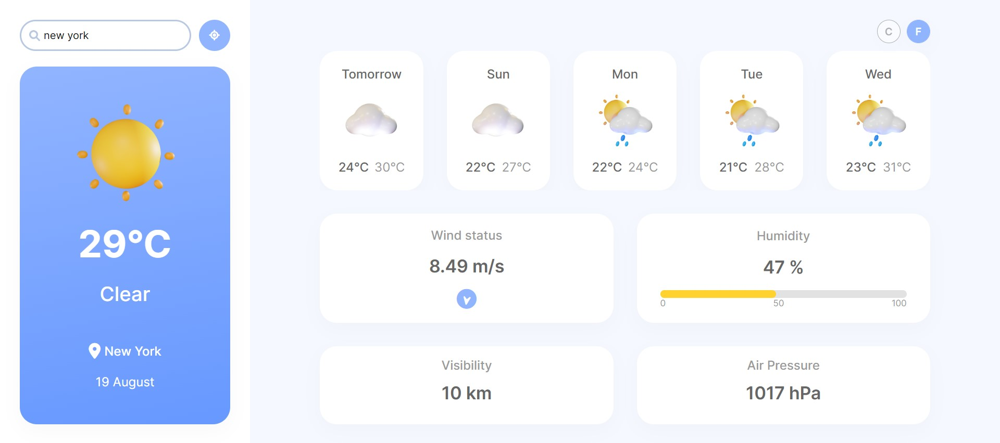

- [Overview](#overview)
  - [Screenshot](#screenshot)
  - [Links](#links)
- [My process](#my-process)
  - [Built with](#built-with)
  - [What I learned](#what-i-learned)

### Overview

This is my portfolio project - Weather App. The purpose of this project was to practice making API calls. A user is able to search a city or locate themselves and see the current weather at that city or at the current location. A user can see a current date, forecast for the next 5 days, wind status, humidity, visibility, and air pressure. It's also possible to convert the degrees to Fahrenheit. The page is fully responsive for different screen sizes. 

### Screenshot

### Links

- Live Site URL: [https://cerulean-klepon-474a39.netlify.app/]

## My process

### Built with
- Weather API
- Geolocation API
- JavaScript (
- Intl.DateTimeFormat()
- querySelector()
- Math.round()
- innerHTML
- classList.add()
- addEventListener();
- For loop
- .slice()
- .push();
- CSS (Flexbox, Grid)
- HTML

### What I learned
I have learned to make API calls and manipulate the received data; add values to arrays and loop through them. I also learned how to get the current location of a user. I practiced updating UI through JS and using flexbox and grid. 
